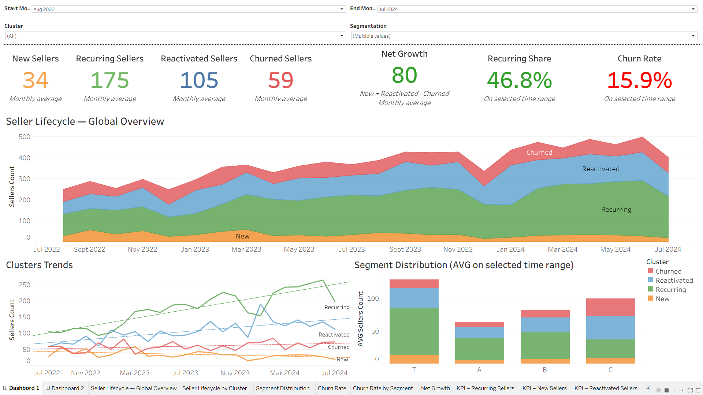
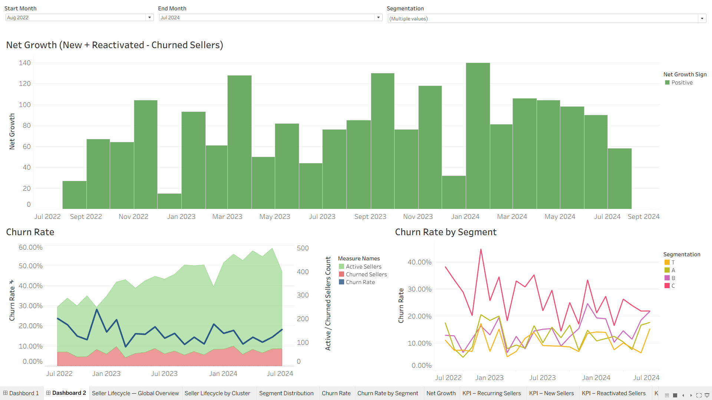

# Automotive Marketplace – Seller Retention Analysis (SQL + Tableau)
*Technical case study based on a synthetic dataset*

## 📌 Overview
This project analyzes seller retention dynamics in an automotive B2B marketplace.  
The goal is to classify seller accounts by activity patterns (new, recurring, reactivated, churned), generate monthly retention KPIs, explore long-term trends, and provide actionable recommendations.

All data used here comes from a **synthetic sample dataset** provided as part of a technical assessment.  
It does **not** reflect real company performance.

---

## 🎯 Objectives
1. **Classify sellers monthly** into the following clusters:  
   - New Sellers  
   - Recurring Sellers  
   - Reactivated Sellers  
   - Churned Sellers  

2. **Generate a monthly overview** of the number of sellers in each lifecycle cluster.

3. **Build Tableau dashboards**:
   - cluster-level view with filters  
   - segmentation filter (T, A, B, C)  
   - time-series retention and churn analysis  

4. **Interpret long-term retention, churn, and reactivation trends.**

5. **Develop recommendations** to strengthen seller engagement and monitor retention proactively.

---

## 🛠️ Data & Tools
- **SQL (Snowflake-style syntax)**
- **Tableau** – dashboards built from the aggregated monthly dataset
- The project is based on a **sample dataset** including:
  - seller account metadata (unique IDs, segment categories)
  - auction-level activity (dates and successful outcomes)
  
This structure was sufficient to reconstruct monthly activity profiles and classify sellers into lifecycle clusters.

---

## 🧠 SQL Logic & Methodology

The retention model is fully implemented in SQL.  
The script rebuilds month-by-month activity for every seller, detects lifecycle transitions using window functions, and classifies each seller accordingly.

### 🔧 Key steps of the pipeline

1. **Monthly normalization**  
   Successful auctions are grouped by seller and month using `DATE_TRUNC`.

2. **Dynamic month calendar**  
   A continuous timeline is generated (`GENERATOR`) to ensure that months with no activity are still captured.

3. **Seller × month activity grid**  
   Every seller is mapped to every month between their first and last activity to detect gaps.

4. **Feature engineering for lifecycle transitions**  
   - Previous-month activity (`LAG`)  
   - Cumulative active months  
   - Months since last activity (`DATEDIFF`)  
   - Last active month tracking  

5. **Lifecycle classification rules**
   - **New:** first-ever active month  
   - **Recurring:** consecutive active months  
   - **Reactivated:** returns after ≥1 inactive month  
   - **Churned:** 3 full months of inactivity  

6. **Final monthly aggregation**  
   Sellers are aggregated by month × lifecycle cluster × segment (T/A/B/C) for dashboarding.

💡 *The complete SQL script is available here:*  
[`sql/seller_clustering.sql`](sql/seller_clustering.sql)

> ⚙️ The clustering logic combines window functions, a dynamic date calendar, and inactivity-gap calculations to detect lifecycle transitions with high temporal accuracy.

---

## 📊 Tableau Dashboards (Screenshots)

### Global Overview
Seller lifecycle distribution, monthly activity trends, segment mix, and top-level KPIs.

---

### Retention Metrics & Churn Dynamics
Net growth, churn stability, reactivation vs acquisition patterns, and segment-level behavior.

---

## 🔍 Key Insights (Summary)

### 1. A strong and expanding recurring base
Recurring sellers form the **largest and most stable cluster**, growing substantially over the last 24 months.

### 2. Reactivation > Acquisition
Reactivated sellers (~104/month) consistently outpace new sellers (~34/month), reflecting:
- a mature marketplace  
- inventory-driven cycles  
- strong platform loyalty  

### 3. Positive net growth
Net growth has been **positive every month**, averaging +80 sellers/month.

### 4. Controlled churn
Churn remains between **10–18%**, significantly lower and more stable than in earlier years.

### 5. Seasonal patterns
Churn spikes consistently occur in:
- **December (Q4 slowdown)**  
- **July–August (summer dip)**  

These are cyclical, not structural.

### 6. Segment dynamics
- **Segment T**: largest, stable, moderate churn  
- **Segment C**: major recovery from ~40% to ~20–25% churn  
- **Segment A**: lowest churn but smaller volume  

---

## 💡 Recommendations (Summary)

### 1. Optimize reactivation cycles
- Separate short-cycle (1–2 months) and long-cycle reactivations  
- Track the reactivation pool health  
- Adapt engagement based on reactivation patterns  

### 2. Manage seasonal churn proactively
- Pre-season messaging  
- Mid-season outreach  
- Q1 win-back initiatives  

### 3. Monitor new seller acquisition closely
- Use rolling averages and alert thresholds  
- Investigate declines early  
- Link acquisition to segment-level patterns  

### 4. Strengthen retention governance
- Build a dedicated retention dashboard  
- Set alert rules  
- Tie signals to operational actions (AM outreach, automated flows)  

---

## 📄 Full Case Study (Extended PDF)
For the complete analysis with detailed insights, segment deep-dives, and structured recommendations, the full case study is available here:

👉 **[Retention Case Study – Full PDF](docs/retention_case_study_pro.pdf)**

This document provides the complete written interpretation of the dashboards, long-term patterns, seasonal behavior, and strategic recommendations.

---

## 📚 What I Learned
- Designing temporal logic for lifecycle modelling  
- Building SQL-based clustering from raw activity data  
- Analyzing multi-year trends and seasonality  
- Creating clear, actionable dashboards in Tableau  
- Producing business-oriented insights and recommendations  
- Structuring analytical work with clean data storytelling  

---

## 📄 Attachments
- 📘 **Full Case Study PDF:**  
  [`docs/retention_case_study_pro.pdf`](docs/retention_case_study_pro.pdf)

- 🧠 **SQL Script:**  
  [`sql/seller_clustering.sql`](sql/seller_clustering.sql)

- 🖼 **Tableau Screenshots:**  
  [`screenshots/dashboard_overview.png`](screenshots/dashboard_overview.png)  
  [`screenshots/dashboard_retention.png`](screenshots/dashboard_retention.png)

